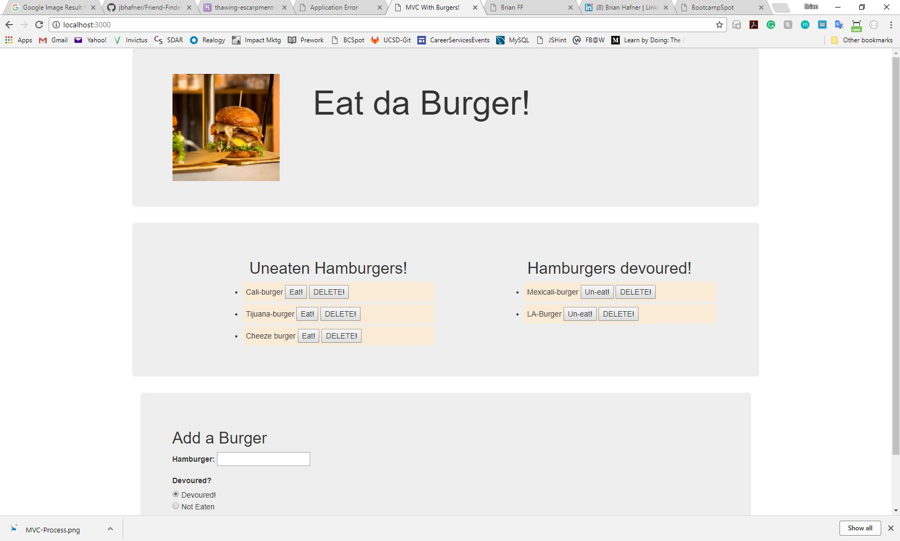

# Eat-da-burger

Technology: MySQL, Node, Express, Handlebars and a homemade ORM.

Design Pattern: Model-View-Controller (MVC)

This app uses Node and MySQL to query and route data using a self-made ORM, and Handlebars to generate your HTML.

